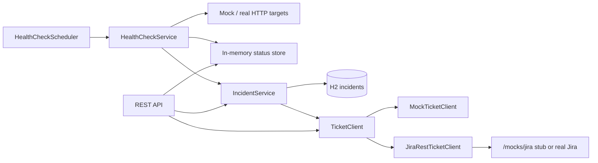

# Architecture

## Overview

`it-ops-monitor` is a Spring Boot service that periodically probes configured HTTP targets, persists failures as SQL incidents, and opens a support ticket (mock or Jira-shaped REST) when an incident is first opened. Built-in mock endpoints make the failure path demoable without external dependencies or Docker.

## Component diagram

## Runtime flow: probe → incident → ticket

1. `HealthCheckScheduler` runs on `ops.monitor.poll-interval-ms` (or `POST /api/health-checks/run`).
2. For each configured target, `HealthCheckService` performs an HTTP GET.
3. Result is saved to the in-memory `HealthStatusStore` (latest status per target).
4. If the target is **down** and no **OPEN** incident exists for that target name:
   - Insert an `INCIDENTS` row (`OPEN`)
   - Call `TicketClient.createTicket(...)`
   - Store `ticketKey` / `ticketUrl` on the incident
5. If the target is **up** and an **OPEN** incident exists:
   - Mark the incident `RESOLVED` and set `resolvedAt`
6. Re-polls while still down do **not** create another OPEN incident or another ticket.

## Packages

| Package | Responsibility |
|---------|----------------|
| `web` | Root JSON, `/api/status`, built-in `/mocks/*` targets |
| `health` | Config, probe service, scheduler, `/api/health-checks` |
| `incident` | JPA entity/repo, open/resolve logic, `/api/incidents` |
| `ticket` | `TicketClient` (mock / Jira REST), `/mocks/jira`, `/api/tickets` |

## Data: `incidents` table

| Column | Purpose |
|--------|---------|
| id | Surrogate key |
| target_name / target_url | What was probed |
| http_status / latency_ms / message | Probe outcome |
| status | `OPEN` or `RESOLVED` |
| detected_at / resolved_at | Timeline |
| ticket_key / ticket_url | Linked support ticket |

## Ticketing modes

| `ops.ticket.provider` | Behavior |
|----------------------|----------|
| `mock` (default) | In-process keys like `OPS-1`; listed at `/api/tickets` |
| `jira` | POST Jira-style payload to `ops.ticket.jira.base-url` (local `/mocks/jira` or real Cloud) |

## Design notes

- Mocks live in-process so the PoC runs with no Docker and no external bank/Jira license.
- Incident dedupe is per target name while `OPEN`, which matches typical ops alert noise control.
- Probe results are kept in memory for fast `/api/status`; durable history is the SQL incident log.
- Tests use an in-memory H2 database and disable scheduling (`src/test/resources/application.yml`).
